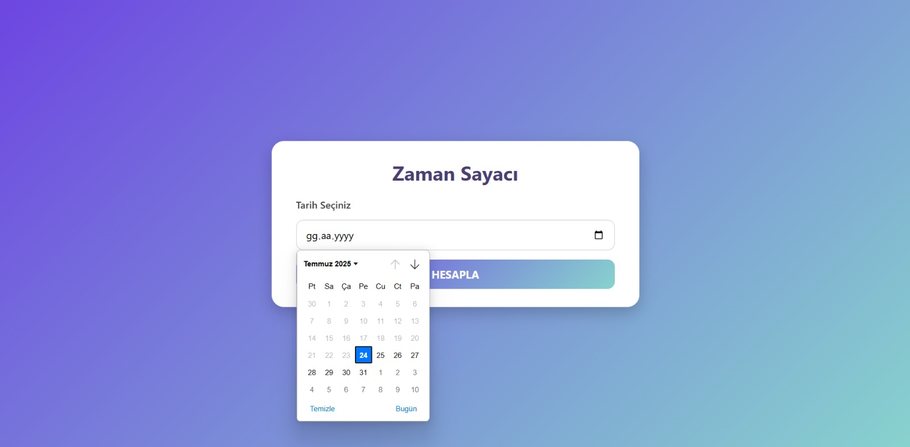

# ⏳ Zaman Geri Sayım (Time Countdown)

Bu proje, belirlediğiniz bir tarihe kalan süreyi (gün, saat, dakika, saniye) hesaplayan modern bir web uygulamasıdır. **HTML, CSS ve JavaScript** kullanılarak geliştirilmiştir.

## 🚀 Özellikler
- Tarih seçerek geri sayımı başlatma
- Canlı gün, saat, dakika, saniye güncellemesi
- Sıfırlama ve yeniden hesaplama
- LocalStorage desteği (sayfa yenilense bile geri sayım devam eder)
- Modern, responsive ve şık tasarım

## 📂 Proje Yapısı
- **index.html** → Sayfa yapısı
- **style.css** → Tasarım
- **script.js** → Geri sayım mantığı

## 🛠 Teknolojiler
HTML5 – CSS3 – Vanilla JavaScript

## 🖼 Ekran Görüntüsü 

